# ZippiFi-概要设计

## 目录

- [一、项目概述](#一项目概述)
- [二、需求分析](#二需求分析)
- [三、产品设计](#三产品设计)
  - [3.1 交易(Swap)](#31-交易swap)
    - [1 任务范围](#1-任务范围)
    - [2 页面示意图：](#2-页面示意图)
    - [3 概念与功能定义](#3-概念与功能定义)
    - [4 页面操作步骤（同链）](#4-页面操作步骤同链)
    - [5 页面操作步骤（跨链）](#5-页面操作步骤跨链)
    - [6 页面展示（信息架构）](#6-页面展示信息架构)
    - [7 关键参数与提示](#7-关键参数与提示)
    - [8 功能模块设计](#8-功能模块设计)
  - [3.2 流动性（liquidity）](#32-流动性liquidity)
    - [一、AMM 流动性流程图](#一amm-流动性流程图)
    - [二、说明文档](#二说明文档)
      - [1. 背景与目标](#1-背景与目标)
      - [2. 参与角色与功能](#2-参与角色与功能)
      - [3. 流程阶段详解](#3-流程阶段详解)
      - [4. 关键指标（简要说明）](#4-关键指标简要说明)
      - [5. 风险控制（简要说明）](#5-风险控制简要说明)
  - [3.3 借贷(Lend)](#33-借贷lend)
    - [1 任务范围](#1-任务范围)
    - [2 页面展示](#2-页面展示)
    - [3 概念与功能定义](#3-概念与功能定义)
    - [4 页面操作步骤（典型用户流程）](#4-页面操作步骤典型用户流程)
    - [5 页面展示（信息架构）](#5-页面展示信息架构)
    - [6 关键指标速览](#6-关键指标速览)
    - [7 功能模块设计](#7-功能模块设计)
  - [3.4 质押（Stake）](#34-质押stake)
  - [3.5 空投（AirDrop）](#35-空投airdrop)
    - [任务范围](#任务范围)
    - [airdrop（空投）功能简介：](#airdrop空投功能简介)
      - [1 概念](#1-概念)
      - [2 小功能（模块）：](#2-小功能模块)
      - [3 页面操作步骤：](#3-页面操作步骤)
      - [4 页面展示与信息架构：](#4-页面展示与信息架构)
      - [5 关键参数与提示：](#5-关键参数与提示)
    - [3 防女巫操作](#3-防女巫操作)
  - [3.6 ai代理](#36-ai代理)
- [四、功能说明](#四功能说明)
  - [1.swap（币币兑换）](#1swap币币兑换包括同链交换与跨链兑换)
  - [2.limit（限价单）](#2limit限价单到价成交)
  - [3.TWAP（时间加权平均价格）](#3twap时间加权平均价格拆分多笔)
    - [TWAP 功能时序示意图](#twap-功能时序示意图)
  - [4.加密货币与法币兑换](#4加密货币与法币兑换)
    - [加密货币与法币兑换功能时序示意图](#加密货币与法币兑换功能时序示意图)
  - [5.市场数据视图](#5市场数据视图)
    - [市场数据视图的数据流与回退逻辑](#市场数据视图的数据流与回退逻辑)
- [五、技术架构设计](#五技术架构设计)
  - [技术栈](#技术栈)
  - [合约架构](#合约架构)
  - [前端架构](#前端架构)
  - [后端服务](#后端服务)
  - [接口定义](#接口定义)
- [六、数据库设计](#六数据库设计)

## 一、项目概述

在去中心化金融（DeFi）快速发展的背景下，传统借贷模式因手续繁琐、效率低下和人为决策风险，已难以满足用户对自动化、低门槛和高收益的需求。为此，我们推出ZippiFi-AI驱动去中心化借贷平台，通过人工智能与区块链技术的深度融合，重新定义借贷体验。
目的：降低用户参与DeFi的门槛，实现策略的自动化执行与动态优化，提升资金利用率和收益稳定性，同时确保操作透明可审计。
背景：依托于链上实时数据（如利率、资产价格、Gas费）和智能合约的不可篡改性，AI代理可替代人工完成复杂决策，避免情绪化操作，并适应市场瞬息万变的需求。

## 二、需求分析

核心用户群体：
- DeFi高频用户：专业交易者、套利者，需快速执行借贷、再平衡等操作，对交易速度与成本敏感。
- AI开发者/机构：部署AI代理管理资产，需自动化执行策略（如动态杠杆、跨协议套利），降低人工干预成本。
- 数据/API提供商：通过微支付（x402）向AI代理出售数据或服务，需低摩擦、即时结算的支付通道。
- 长尾用户：普通DeFi用户，希望授权AI代理管理资产，获取被动收益，同时降低清算风险。

| 用户类型 | 痛点 | 需求 |
| :--- | :--- | :--- |
| DeFi高频用户 | - 手动操作耗时，错过套利机会<br>- 跨链Gas费高，成本不可控 | - AI代理自动化执行策略<br>- 跨链微支付优化成本 |
| AI开发者 | - 传统支付网关（如信用卡）不支持链上地址<br>- 微支付需集成多协议，开发复杂 | - x402协议标准化支付接口<br>- 链上身份（钱包地址）作为唯一授权标识 |
| 数据提供商 | - 中心化支付平台抽成高<br>- 小额支付结算周期长 | - 去中心化微支付（0.01 USDC级）<br>- 即时结算，无中间商 |
| 长尾用户 | - 缺乏专业知识，易被清算<br>- 手动调整策略效率低 | - AI代理自动风险管理<br>- 一键授权，低门槛参与 |


## 三、产品设计

### 3.1 交易(Swap)

#### 1 任务范围

- 仅分析 `Swap`（代币兑换）功能的产品与技术设计。
- 对标 uniswap/PancakeSwap/BabySwap 的 V2 路由模式，兼容收税代币与多跳路径。
- 关注前端交互、链上调用、风控与可观测性，不涉及其他模块。

#### 2 页面展示

uniswap

pancakeswap


#### 3 概念与功能定义

- Swap 指在去中心化交易所（DEX）中用一种代币兑换另一种代币。核心目标是以尽可能好的路径与滑点保护，在同链原子结算或跨链多阶段流程中完成兑换。
- 同链为单笔链上原子交易；跨链通常为“源链锁定/桥接 → 目的链兑换”的两段式或异步流程。
- 路由器会在多个池子与多跳路径间优化，兼容收税代币与不同小数位的资产。

- 同链市价兑换（即时 Swap）：基于当前池子价格执行，支持多跳与最小到手保护。
- 限价单（Limit）：设置目标价，达到后执行；适合等待到价成交。
- TWAP（分批到均价）：将大额兑换拆分为多批，降低价格冲击与滑点。
- 跨链兑换：源链锁定或桥接消息，目的链执行兑换并回传结果与状态。
- 滑点与截止时间：订单保护边界与超时控制，防止极端波动导致超价成交。
- 路径优化与多跳：在多池子间寻找最优路径，兼顾可成交性与价格影响。
- 收税代币支持：使用兼容 fee-on-transfer 的路由方法与最小到手校验。
- 授权与余额检查：自动检测并引导 `approve`，校验余额与额度。
- 失败类型与重试：价格变化/滑点超限/Gas 估算失败等，提供重试与提示。
- 市场数据视图：实时报价图、滑点区间、热门路径与失败统计辅助决策。

#### 4 页面操作步骤（同链）

- 第一步：选择代币与链、输入兑换数量
  - 校验代币 `decimals/余额/授权`，提示最小单位与小数精度。
- 第二步：获取报价与路径
  - 展示 `预估到手/价格影响/滑点`，可打开“详细路径与池子流动性”。
- 第三步：设置保护与选项
  - 滑点与截止时间（如 0.5%/10 分钟）；可选择私有 RPC 或 MEV 保护选项。
- 第四步：授权与提交交易
  - 若未授权则先 `approve`，随后提交路由交易；展示 Gas 预估与费用。
- 第五步：确认与结果回填
  - 等待区块确认，显示成交明细、到手数量差异、失败原因与重试建议。

#### 5 页面操作步骤（跨链）

- 第一步：选择源链与目的链、代币与数量
- 第二步：获取跨链报价与费用
  - 展示桥接费、目的链 Gas 预算、双滑点与双截止时间设置。
- 第三步：源链侧执行
  - 发起源链锁定/桥接交易，提示事件监听与预计时延。
- 第四步：目的链侧执行
  - 后端/桥消息触发目的链兑换；用户查看状态进度与风险提示。
- 第五步：完成与回传
  - 展示目的链到手数量与费用明细，失败时提供退款/重试流程说明。

#### 6 页面展示（信息架构）

- Swap 主页面：
  - 代币选择器、金额输入、当前汇率与滑点保护、路径与价格影响、Gas 与费用提示。
- 路径详情与池子流动性：
  - 多跳路径、各池子深度与费率、预计到手分解与风险标签（小流动性/收税代币）。
- 高级选项：
  - 滑点与截止时间、私有 RPC/MEV 保护、最小到手校验开关、收税代币兼容提醒。
- 结果与历史：
  - 成交结果、失败类型归因与提示、交易历史与导出；跨链显示桥接进度与状态机。
- 市场数据页（联动）：
  - 实时报价图、OHLCV、TWAP/均线叠加、热门路径与失败统计，用于决策与风控。

#### 7 关键参数与提示

- 滑点：兑换价格保护的百分比边界；过小可能成交失败，过大可能价格恶化。
- 截止时间：订单超时时间；超时后需重报报价或重新提交。
- 价格影响：路径对池子价格的冲击程度；建议在低流动性时采用小额或 TWAP。
- Gas 与费用：包含链上 Gas、跨链桥费（跨链时）；透明展示总成本。
- 授权与额度：`approve` 额度建议使用精确或最小必要，避免无限授权风险。
- 风险提示：收税代币、预言机异常（若显示参考价）、跨链时延与失败回滚策略。

#### 8 功能模块设计

SWAP 功能包括以下几个功能：

1.swap（币币兑换，包括同链交换与跨链兑换）

- 概念：在同一链内或跨链进行代币兑换；同链为原子结算，跨链为多阶段且包含桥接与目的链执行。
- 流程：选择代币与金额 → 获取报价与路径 → 授权/模拟 → 下单并以最小到手保护（滑点）。
- 特殊：收税代币需使用支持费的路由方法；跨链需考虑桥费用、消息验证与目的链 gas 提示。

 同链 vs 跨链 Swap 概览时序图

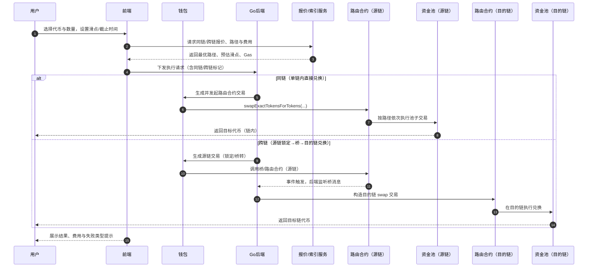

ASCII 概览：

`U → FE → BE → WL → (同链: RT → PO) | (跨链: 源链RT/桥 → DRT → DPO) → U`

图中要点：

- 双滑点/双截止时间：同链一次校验；跨链需源链与目的链分别设置与校验。
- 费用提示：跨链需桥费与目的链 Gas 预算；同链仅链内 Gas。
- 状态与回滚：监听事件与桥消息，失败时提供重试/退款策略与清晰提示。

2.limit（限价单，到价成交）

- 概念：仅当目标价格达到或更优时才执行兑换，提供价格保护与被动成交能力。
- 方式：后端监控到价触发或协议级限价订单（可取消与到期）；到价时再执行链上 swap。
- 关键：触发价、最小到手、滑点与到期时间；采用预言机/多源报价防尖刺与误触发。

 限价单功能时序示意图

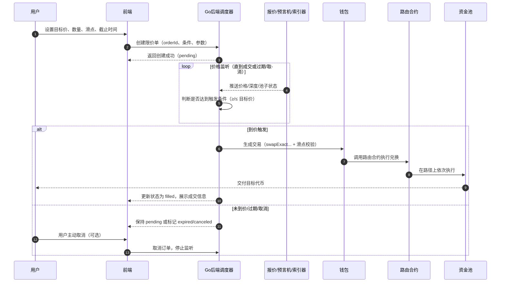

ASCII 概览：

`U → FE → BE ↔ PX → WL → RT → PO → U`

要点提醒：

- 触发条件：支持“价格 ≥/≤ 目标价”，可选择使用 TWAP/中位价以降低噪声。
- 滑点与截止：到价后仍需滑点保护；订单具有过期时间与重试策略。
- 部分成交：默认全额成交，若需分批成交请结合 TWAP/分批逻辑。
- 数据来源：以链上池子价格为主，预言机/聚合价仅作锚定与异常告警。
- 失败回滚：成交失败时提示原因（价格变化/滑点超限/Gas 不足），支持重试或取消。

3.TWAP（时间加权平均价格，拆分多笔，）

- 概念：在一段时间内将大单拆分为多笔执行，使成交均价更接近期间平均价格，降低单次冲击与滑点。
- 参数：批次数/间隔、单批滑点与价格影响阈值、执行窗口与重试策略；可用私有 RPC 降低 MEV 风险。
- 场景：大额兑换、低流动性池、做市与风控策略；可配合到价条件组合使用。

 TWAP 功能时序示意图

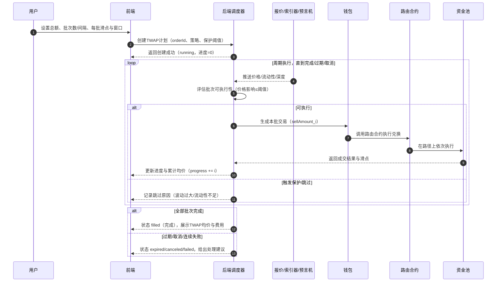

ASCII 概览：

`U → FE → BE ↔ PX → WL → RT → PO → FE`

要点提醒：

- 策略选择：均分批次或自适应（按实时深度调整单批数量）。
- 噪声抑制：用中位价/TWAP/价格带判断是否执行，避免尖峰影响。
- 风控阈值：单批最大价格影响、连续失败上限、总窗口截止时间。
- 费用与 MEV：建议支持私有 RPC 或保护标志，展示累计 Gas 与桥费（跨链时）。

4.加密货币与法币兑换

- 概念：通过法币通道（on-ramp/off-ramp）在链下完成加密货币与法币的兑换。
- 方式：集成第三方服务（如 Transak/Ramp/Mercuryo），涉及合规/KYC/反洗钱与支付结算。
- 区分：不同于链上 swap；通常走外部支付与托管流程，费用与时延、失败处理都与链上交易不同。

 加密货币与法币兑换功能时序示意图

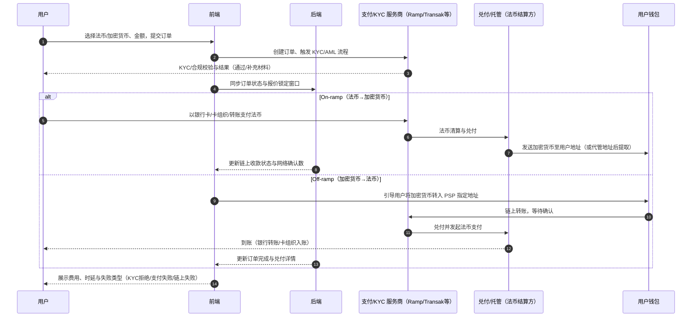

ASCII 概览：

`U → FE → PSP/KYC ↔ BE → (On-ramp: OTC → WL) | (Off-ramp: WL → PSP/OTC → 银行) → U`

要点提醒：

- 合规与限额：不同地区的 KYC/AML 要求与单笔/日累计限额需明确提示。
- 报价与锁定：法币 ↔ 加密货币汇率有锁定窗口与滑点条款，超时需重报。
- 费用组成：支付手续费、兑付/清算费、链上 Gas；分场景透明展示。
- 时延与风险：法币侧结算通常 T+0/T+1；链上需确认数；失败要清晰归因。
- 退款/申诉：支付失败或 KYC 拒绝时的退款路径与时效说明。

5.市场数据视图

- 概念：展示价格随时间的变化与关键交易指标，帮助用户决策与风控。
- 内容：当前报价、滑点/价格影响、路径分解、池子流动性与事件状态；可叠加热门路径与失败类型统计。
- 作用：提高可观测性与透明度，支持提示与错误映射，优化用户体验。

- 概念扩展：

  - 数据分层：即时报价（Tick/Depth）、K 线/OHLC（1m/5m/1h/1d）、链上池子状态（储备/费率/TVL/交易量）、事件与告警（暂停、池子迁移、路由变更）。
  - 指标体系：价格影响/滑点、最优路径对比、流动性占比、交易失败类型分布、MEV 风险提示、预估 Gas 与成功率。
  - 一致性与延迟：不同数据源存在更新延迟与采样差异，需在 UI 明示时间戳与来源，避免决策偏差。

- 可用数据源（示例）：

  - 链上直读：`RPC/Provider`（Infura/Alchemy/自建节点）读取池子储备、费率、tick、事件日志。
  - 子图索引：`The Graph`（Uniswap/Sushi/Curve 官方或社区子图）获取历史交易量、TVL、K 线聚合等。
  - 聚合器 API：`1inch`、`0x`、`OpenOcean` 路由与报价；用于路径与价格影响对比。
  - CEX/行情：`TradingView` 图表组件或 `Lightweight Charts` + 第三方行情源（如 `CoinGecko/CoinMarketCap`）；用于可视化与参考价格。
  - 自建数据后端：Kafka/ClickHouse/TimescaleDB 存储与聚合，提供统一查询与缓存（BFF/GraphQL）。
  - 监控与告警：Prometheus/Grafana 订阅合约事件与 API 健康，生成暂停/异常提示。

- 集成建议：
  - 数据代理层（BFF）：统一封装来源、降采样与缓存策略，向前端暴露一致的字段与时间戳。
  - 容错与回退：主源失败时切换备源；显示“数据延迟/来源切换”提示，避免误导。
  - 合规与版权：明确数据来源与使用条款（TradingView/CoinGecko 等），遵守速率限制与品牌规范。
  - 可观测性：记录查询耗时、错误率与来源占比，用于优化体验与成本。

以下示意图展示市场数据视图的数据流与回退逻辑：

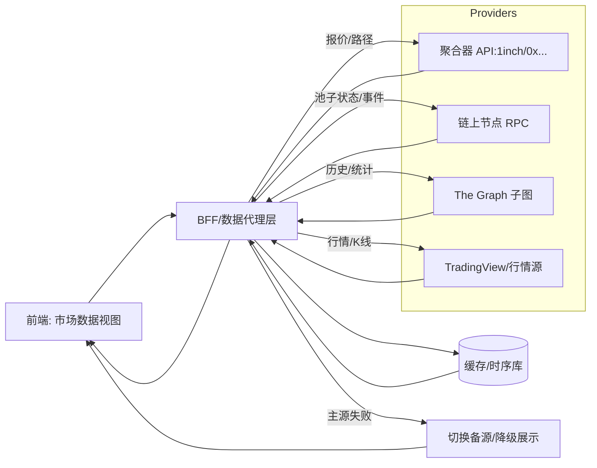

- 字段与展示建议：
  - 价格/时间戳/来源：`price`, `ts`, `source`；在图表上显示数据延迟与来源徽标。
  - 滑点与路径：`priceImpact`, `route`, `liquidityShare`；支持展开路径明细与费用构成。
  - K 线与指标：`open/high/low/close/volume`；可叠加 `EMA/SMA/Bollinger` 与交易量柱。
  - 告警与状态：池子暂停/迁移、异常波动、API 限流；在 UI 显示醒目提示与回退状态。


### 3.2 流动性（liquidity）

流动性流程

#### 一、AMM 流动性流程图

```
用户资产准备
       │
       ▼
  连接钱包 & 选择池
       │
       ▼
  流动性提供 (Deposit)
       │
       ▼
 LP 代币发放 (Liquidity Receipt)
       │
       ▼
   流动性使用
(交易/借贷/套利/收益聚合/跨链优化)
       │
       ▼
  收益与费用分配
       │
       ▼
   监控与风险管理
       │
       ▼
  流动性调整 / 迁移 / 退出
       │
       ▼
 用户提取资产 + 收益
```

------

#### 二、说明文档

 1. 背景与目标

AMM（Automated Market Maker）是去中心化金融（DeFi）生态系统的核心基础设施之一。与传统交易所不同，AMM 不依赖订单簿，而是通过公式自动调整流动性池内资产价格，实现交易匹配。最新 AMM 流动性流程结合了 Web3.0 特性，如集中流动性、跨链流动性、收益聚合和风控优化。

**目标**：

- 为交易者提供高效、低滑点的即时流动性；
- 为流动性提供者（LP）提供可观收益及额外激励；
- 自动平衡池内资产比例以反映市场价格；
- 支持集中流动性、跨链资产利用和收益优化策略；
- 引入智能监控及风控机制，降低无常损失和风险暴露。

------

 2. 参与角色与功能

| 角色                            | 功能                                                  |
| ------------------------------- | ----------------------------------------------------- |
| **流动性提供者 (LP)**           | 存入资产到 AMM 池中获取 LP 代币，参与收益分配及奖励。 |
| **交易者 / 借贷者**             | 使用池中的流动性进行资产兑换或借贷，产生手续费。      |
| **智能合约**                    | 管理池内资产、执行交易公式、发放奖励、监控状态。      |
| **跨链聚合器 / 流动性迁移工具** | 在多链或多协议之间优化流动性配置，提高收益。          |
| **监控与治理系统**              | 实时监控风险、调整参数、触发治理提案和紧急措施。      |

------

 3. 流程阶段详解

 （1）用户资产准备

- **目标**：确保 LP 有足够的资产和支付 Gas 的能力。
- **步骤**：
  1. 选择提供流动性的资产对（例如 ETH/USDC、DAI/USDT）。
  2. 检查钱包余额及链原生代币（用于 Gas 支付）。
  3. 分析目标池的收益率（APR/APY）、无常损失预期、风险水平。
  4. 可进行模拟交易或使用 LP 收益计算器预测潜在收益。
- **注意**：资产准备阶段的多样化策略可降低风险，优化收益。

------

 （2）连接钱包 & 选择池

- **目标**：绑定用户身份，并选择最优流动性池。
- **步骤**：
  1. 链接去中心化钱包（如 MetaMask、Coinbase Wallet）。
  2. 浏览可参与池列表，包括不同类型：
     - **恒定乘积池**（x·y=k，例如 Uniswap v2/v3）
     - **稳定币曲线池**（如 Curve，低滑点）
     - **集中流动性池**（v3 特色，可在指定价格区间提供流动性）
     - **跨链池**（如跨链桥或聚合 AMM）
  3. 设置资产投入比例、价格区间（集中流动性适用）及预期收益策略。
- **注意**：选择池时要关注交易深度、手续费率、流动性奖励及潜在风险。

------

 （3）流动性提供 (Deposit)

- **目标**：将资产安全存入 AMM 池，并获得 LP 代币。
- **步骤**：
  1. 用户授权智能合约使用资产。
  2. 智能合约将资产存入池中。
  3. 系统根据投入金额及池内比例发放 LP 代币。
  4. LP 代币可进一步质押（Staking）获取额外奖励（如治理代币）。
- **公式示例**：
  - 恒定乘积：x * y = k
  - 集中流动性收益按价格区间加权计算
- **注意**：提供流动性时需考虑 **无常损失（Impermanent Loss）**，不同池类型风险不同。

------

 （4）流动性使用

- **目标**：池内资产被交易、借贷或套利使用，实现收益。
- **步骤**：
  1. AMM 自动执行交易公式（如恒定乘积、稳定币曲线、集中流动性区间算法）。
  2. 交易者使用流动性池完成交换，借贷者使用资产。
  3. 系统记录交易手续费、奖励代币、借贷利息。
  4. 可通过跨链或跨协议聚合器优化流动性使用，提高收益。
- **收益来源**：
  - 交易手续费
  - 借贷利息
  - 协议奖励（如治理代币、流动性挖矿奖励）
- **注意**：集中流动性池在价格偏移时可能需要调整资产分布。

------

 （5）收益与费用分配

- **目标**：公平分配流动性提供者收益。
- **步骤**：
  1. 按 LP 代币份额计算手续费收入。
  2. 额外奖励（如挖矿代币、质押奖励）按质押比例发放。
  3. 系统监控无常损失和资产波动，提供调整建议。
- **说明**：收益可自动复投以实现复利策略。

------

 （6）监控与风险管理

- **目标**：保障 LP 资金安全，优化资产配置。
- **步骤**：
  1. 实时监控 TVL、流动性深度、交易量、滑点、资产占比。
  2. 异常情况（大额提取、价格剧烈波动）触发预警或暂停操作。
  3. 提供流动性优化建议（集中流动性区间调整、跨链迁移）。
- **技术手段**：
  - 智能合约监控事件触发
  - 价格预言机更新
  - 自动化风控脚本执行

------

 （7）流动性调整 / 迁移 / 退出

- **目标**：LP 根据策略和风险调整资产或退出池。
- **步骤**：
  1. 使用 LP 代币兑换资产及收益。
  2. 可跨链迁移或迁移至收益更优的池。
  3. 完成退出，收益结算至钱包。
- **注意**：
  - 提前计算手续费、滑点和无常损失
  - 跨链操作注意桥接风险

------

 4. 关键指标（简要说明）

| 指标                          | 意义                                               |
| ----------------------------- | -------------------------------------------------- |
| **TVL（Total Value Locked）** | 流动性池中总资产规模，反映池受欢迎程度及风险敞口。 |
| **流动性深度**                | 池内可交易资产量，影响滑点大小及交易体验。         |
| **交易量与手续费收入**        | 衡量池活跃度及 LP 收益水平。                       |
| **无常损失水平**              | 资产价格波动导致 LP 相对持有损失的量化指标。       |
| **流动性利用率**              | 资产被交易使用的效率，帮助优化池配置。             |
| **跨链资产分布**              | 多链资产流动性状态，有助于跨链策略优化和风险管理。 |

------

 5. 风险控制（简要说明）

| 风险类型                  | 控制措施                                                     |
| ------------------------- | ------------------------------------------------------------ |
| **智能合约风险**          | 多方审计、Formal Verification、Bug Bounty 奖励机制。         |
| **桥接 / 跨链风险**       | 使用可靠桥接协议，多签或保险机制降低资产损失风险。           |
| **流动性碎片化**          | 集中流动性管理、流动性池优化算法降低无常损失。               |
| **价格波动与滑点**        | 使用预言机提供价格参考，限制大额交易，触发警告或暂停操作。   |
| **预警机制 & 自动化风控** | 自动监控大额交易、异常价格变化，及时通知 LP 或采取保护措施。 |

### 3.3 借贷(Lend)

#### 1 任务范围

- 仅分析 `Lend`（借贷）功能的产品与技术设计。
- 对标 Aave/Compound 的借贷市场模型：支持存款、借款、抵押、利息累积与清算机制。
- 资产范围：明确可抵押资产与可借资产清单，包含 `decimals`、价格源、抵押参数（LTV、LT、清算罚金）。
- 利率模型：覆盖固定/可变利率、基于利用率的利率曲线（线性/分段），以及利息计提与指数（如 `liquidityIndex`）。
- 价格与风控：集成预言机（Chainlink/Pyth）作为价格锚；定义风险参数、触发阈值与清算流程（健康因子计算）。
- 清算流程：部分/全额清算路径、折扣与罚金、清算人激励；异常与边界处理（价格异常、预言机失效）。
- 前端交互：存款/取款、借款/还款、抵押管理、健康因子与风险提示、利率与收益展示。
- 后端与索引：订单与头寸状态索引、利息累计计算、风险预警（健康因子低于阈值）、事件回填与报表。
- 合约接口：与池子/借贷市场合约交互的核心方法（`deposit`、`withdraw`、`borrow`、`repay`、`setCollateral`、`liquidate`）。
- 可观测性：关键事件与失败类型映射、费用与收益统计、异常价格/清算告警与审计日志。
- 范围不含：跨链借贷、闪电贷与高级策略（可在扩展章节单独评估）。

#### 2 页面展示

aave
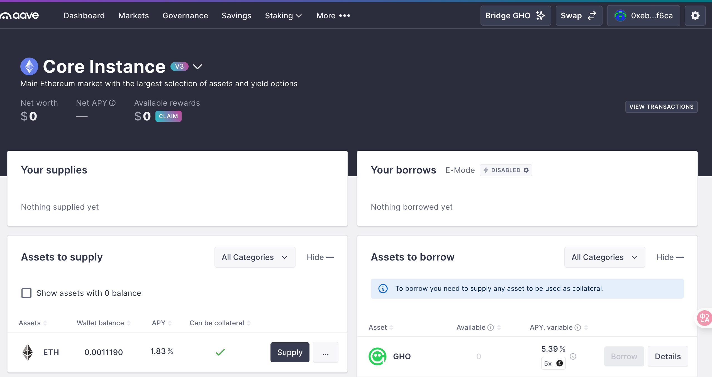
compound


#### 3 概念与功能定义：

 概念

- 借贷市场允许用户将资产存入池子赚取利息（Supply），并以存入资产作为抵押借出其他资产（Borrow）。利息按区块/时间累积，利率可为可变或稳定。头寸以“健康因子（HF）”衡量风险，低于阈值会触发清算。

 与质押（Stake）的区别

- 目标不同：Stake 侧重锁仓换奖励/通胀分发或网络安全；Lend 侧重资金利用与信贷。
- 风险模型：Stake 通常无借贷与清算风险；Lend 存在价格波动与清算机制（LTV/LT/罚金）。
- 收益来源：Stake 多为协议发放/通胀；Lend 收益来自借款人支付的利息（按利用率动态）。
- 流动性与退出：Stake 常有限定期或解质押规则；Lend 取决于池子可用流动性与风险状态。

 借贷包含的小功能（模块）

- 存款/取款（Supply/Withdraw）：将资产存入/取出池子，获得/减少利息权。
- 启用/取消抵押（Enable/Disable Collateral）：决定该资产是否计入抵押价值。
- 借款/还款（Borrow/Repay）：按抵押能力借出与归还目标资产。
- 利率模式切换（Stable/Variable）：在稳定利率与可变利率间切换（受限于协议规则）。
- 头寸风险与健康因子：实时显示 HF、预计 HF（操作前后），风险预警与告警。
- 清算视图与模拟：展示清算阈值、罚金与折扣，提供模拟工具与风险提示。
- 奖励与激励（可选）：供应/借款可能有挖矿奖励或积分，分场景展示。
- 历史与报表：存借还取记录、利息计提、奖励累计与导出。
- 风控参数展示：LTV、LT（清算阈值）、清算罚金、储备因子、隔离/冻结状态。
- 价格与预言机：显示价格来源（Chainlink/Pyth），异常喂价与失效提示。

#### 4 页面操作步骤（典型用户流程）

- 第一步：选择资产并存款
  - 查看 `Supply APY/可用流动性/抵押系数`，授权并提交存款交易。
- 第二步：启用抵押
  - 打开抵押开关，确认 `LTV/LT` 与预计健康因子变化。
- 第三步：借款资产
  - 选择要借的资产与金额，查看 `Borrow APY/预计 HF/利率模式`，提交借款交易。
- 第四步：管理头寸
  - 监控 HF 与市场波动，支持补仓（增加抵押）、部分还款、利率模式切换。
- 第五步：还款与取款
  - 归还借款后，按可用流动性与风险状态取回抵押资产；失败时给出可操作建议。
- 异常流程：
  - HF 接近 1 时弹出高风险提示；价格异常或预言机失效时，限制危险操作并提示来源。

#### 5 页面展示（信息架构）

- 市场页（Markets）：
  - 列出资产的 `Supply APY`、`Borrow APY`、`利用率`、`可用流动性`、`抵押系数`、`风险标签（主流/隔离/冻结）`。
- 资产详情页：
  - 历史 APY 与利用率曲线、储备因子、`LTV/LT/罚金`、价格来源与稳定性，入口操作（存款/借款）。
- 个人仓位页（Portfolio）：
  - `供应总额/借款总额/健康因子`、抵押/借款资产列表、收益与成本统计、风险预警卡片与操作快捷入口。
- 借款流程页（Borrow）：
  - 选择资产、输入金额、预估 HF、利率模式（稳定/可变）、限制与费用提示。
- 清算/告警视图：
  - 当前清算风险、潜在清算折扣与罚金、失败类型说明；可并入 Portfolio 的告警卡片。
- 历史与报表：
  - 交易历史、利息计提与奖励记录、CSV/JSON 导出。

#### 6 关键指标速览

- 健康因子（HF）：`HF = (Σ 抵押价值 × LT) / Σ 借款价值`，当 `HF < 1` 时可被清算。
- LTV（贷款价值比）与 LT（清算阈值）：定义可借额度与清算触发边界。
- 利用率（U）：`U = 借款总额 / 供应总额`，影响可变利率与 APY。
- 利息与指数：协议按指数累积方式计提利息，影响余额与收益显示。

#### 7 功能模块设计

 核心概念速览

- 存款（Supply/Deposit）：将资产存入协议以获得利息与票据资产（如 aToken）。
- 借款（Borrow）：以抵押资产为担保借出目标资产，形成债务余额并按利率计息。
- 抵押（Collateral）：可被用作担保的资产集合，影响可借额度与健康因子。
- 健康因子（HF）：衡量账户安全性的指标，`HF > 1` 通常安全；`HF ≤ 1` 可能被清算。
- 清算（Liquidation）：当账户 HF 低于清算阈值时，清算人偿还部分债务并获得抵押资产折扣。
- 利率模式：稳定利率（Stable）与可变利率（Variable），可按规则切换。
- 利用率（U）：池子层面的拥挤度，影响可变利率曲线与借款 APY。
- 预言机（Oracle）：为风险评估提供价格数据，决定 HF 与可借额度的有效性。

 关键功能清单

- 存款/取款（Supply / Withdraw）：存入资产赚取利息；符合规则时提取部分或全部资产。
- 借款与还款（Borrow / Repay）：选择利率模式与数量，生成并偿还债务。
- 抵押管理：启用/停用某资产为抵押，调整抵押比例以优化 HF 与可借额度。
- 利率模式切换：在稳定/可变利率间切换（受协议限制与费用约束）。
- 风险与指标视图：实时显示 HF、可借额度、价格影响、池子利用率 U、预估 APY 等。
- 闪电贷与再抵押杠杆（进阶）：以单笔交易临时借入资产实现杠杆或再平衡（需风控）。
- 价格与参数来源：展示预言机价格、LTV、清算阈值、清算奖金、隔离资产/借款上限等。
- 清算入口与规则说明：当账户进入可清算区，支持清算操作与风险提示。

 1.存款/取款（Supply / Withdraw）

 概念说明

- 存款（Supply/Deposit）：将资产存入协议的资金池以赚取利息，同时获得票据资产（如 aToken）用于余额展示与收益计提。
- 取款（Withdraw/Redeem）：赎回已存入的资产，受池子可用流动性、账户健康因子与抵押占用约束。
- 授权与提交：ERC20 资产需先 `approve` 给协议合约，再执行 `supply`；取款无需授权，但可能受抵押与 HF 约束。
- 利息与指数：协议通过指数累计计息，票据资产余额与 APY 随时间增长。
- 抵押开关：将某存入资产标记为“可用作抵押”影响可借额度与 HF；取款时需保证 HF 不跌破阈值。
- 常见约束：
  - 流动性不足：池子可用余额不足时，仅支持部分取款或排队。
  - 抵押占用：取款会降低抵押价值，若导致 HF 过低，会被阻断。
  - 隔离/暂停：隔离资产或治理暂停的市场可能限制取款与供应。

 功能时序示意图（Supply/Withdraw）

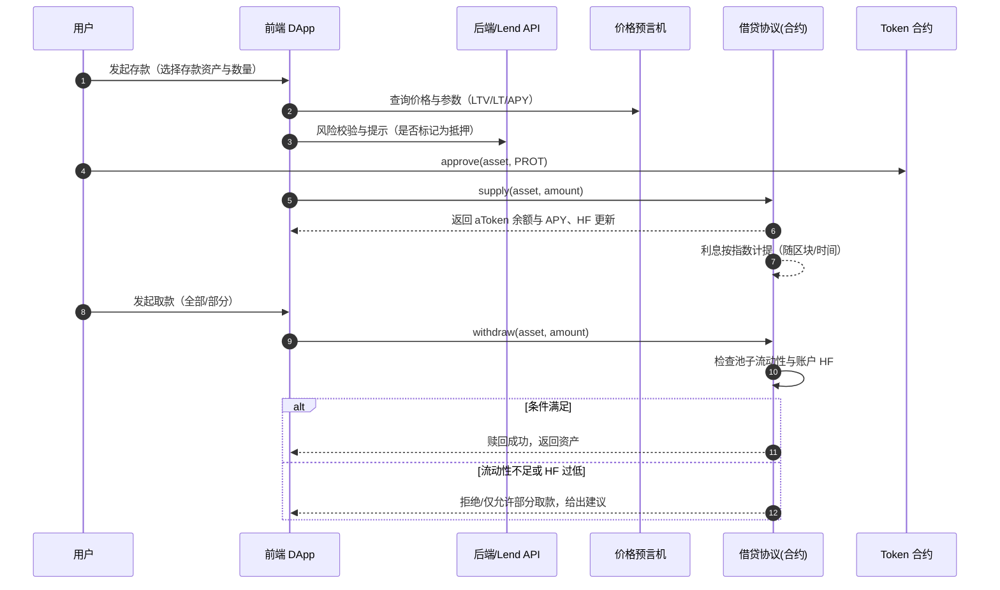

要点：

- 提交前展示 HF 影响与“可取额度”计算；不足时给出“减少取款”“关闭抵押”“先还款”建议。
- 同步展示利率来源与 APY 构成（基础利率、利用率曲线、协议奖励）。
- 对隔离或暂停市场明确标注限制与治理状态，避免误操作。

 2.借款与还款（Borrow / Repay）

 概念说明

- 借款（Borrow）：以启用为抵押的资产作为担保，按所选利率模式借出目标资产并形成债务余额。
- 还款（Repay）：偿还全部或部分债务，减少利息累计并提升健康因子（HF）。
- 利率模式：
  - 可变利率（Variable）：随池子利用率 U 变化；逼近 kink 后利率陡增。
  - 稳定利率（Stable）：相对平滑但可能较高，受切换/上限/资格规则约束。
- 可借额度：由抵押资产价值与 LTV/清算阈值决定；页面展示“最大可借”“安全可借”。
- 约束与限制：隔离资产、借款上限、市场暂停、利率模式切换费用与资格、抵押开启状态。

 功能时序示意图（Borrow/Repay）

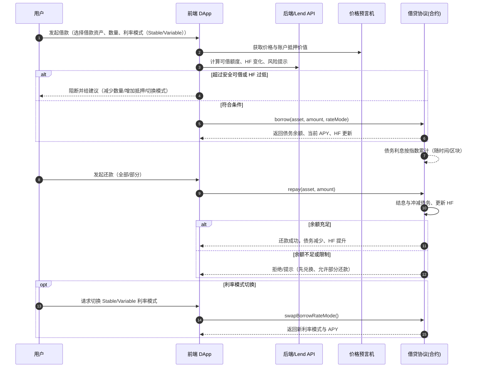

要点：

- 借款前展示“最大/安全可借”，并实时计算交易后 HF；超阈值时强制阻断。
- 清晰标注隔离资产、借款上限、暂停状态与模式切换资格/费用。
- 还款支持部分/全部两种；余额不足时引导用户先兑换或使用相同资产偿还。
- 展示 APY 构成与来源（基础利率、利用率曲线、奖励），与价格来源的可信度说明。

 3.闪电贷

 概念说明

- 闪电贷（Flash Loan）：在“同一笔交易”中无抵押借入资产，必须在交易结束前归还本金+费用；未归还则整笔交易回滚（原子性）。
- 典型用途：
  - 套利/价差（跨 DEX 路径套利）。
  - 抵押再融资（偿还旧债 → 提取抵押 → 转换资产 → 重新开仓）。
  - 抵押资产置换（collateral swap）。
  - 协助清算（先借款偿债 → 获得抵押折扣）。
- 关键属性：原子性、费用率、可用流动性与上限、重入保护、滑点与 MEV 风险。

 功能时序示意图（Flash Loan）

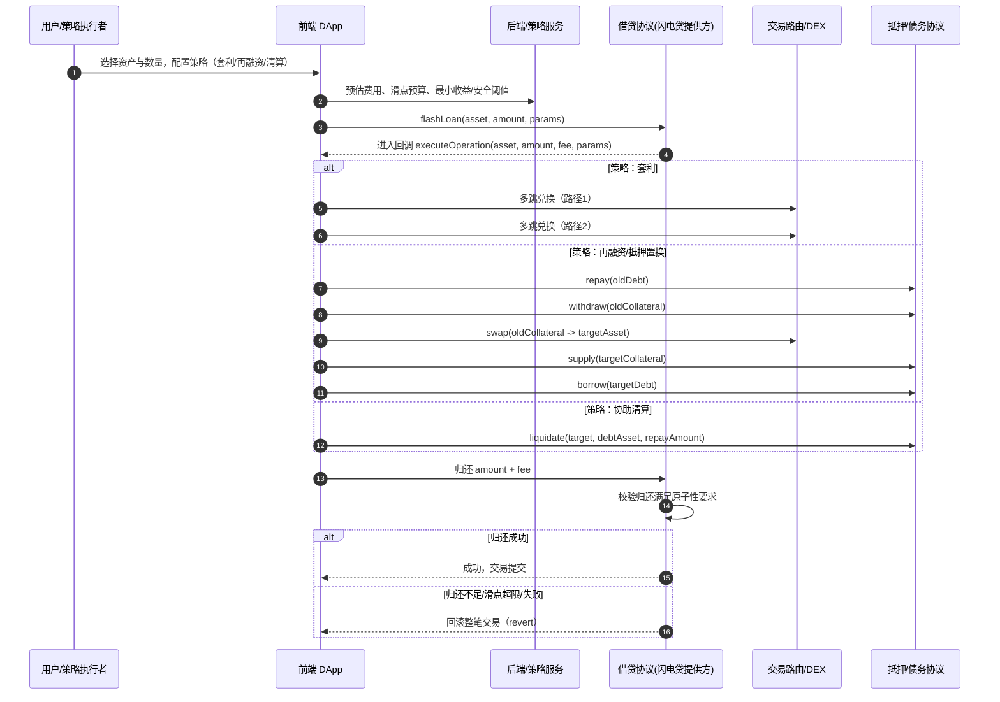

要点：

- 原子性保障：任何一步失败或利润低于阈值，应主动 `revert`，避免亏损交易上链。
- 预算与阈值：在前端设定“最小可接受收益”“最大滑点”“Gas 预算”，并在回调内严格检查。
- 流动性与费用：受池子可用额度与费用率影响；高拥堵期费用与 MEV 风险上升。
- 安全与合规：使用重入保护、防止价格操纵（TWAP/中位数）、限制可调用目标合约白名单。

 回滚逻辑示意

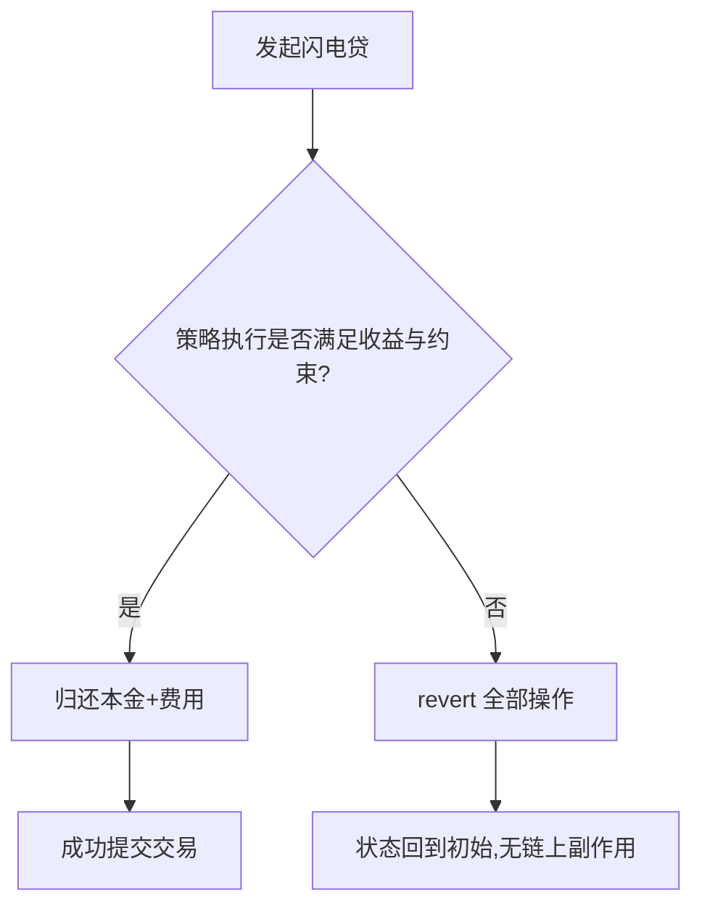

提示：为面试/评审展示时，可在 UI 中同步显示：

- 预计费用与最小收益门槛、可用流动性上限、滑点与路径详情。
- 风险提示（原子回滚、失败常见原因、MEV 与价格波动）。

### 3.4 质押（Stake）

### 3.5 空投（AirDrop）

#### 1 任务范围

- 仅分析 `Airdrop`（空投）功能的产品与技术设计。
- 范围涵盖：资格规则与快照、反女巫/防刷、分发与领取流程、合约与数据存储、前后端交互与可观测性。
- 合约与分发：`MerkleDistributor`/白名单签名、`ERC20` 发放、`claim` 校验、重复领取防护、可选 `vesting/锁仓/线性释放`、领取截止与回收策略。
- 数据与后端：快照生成、Merkle 树/证明计算、名单版本化与存储（`IPFS/Arweave/S3`）、接口鉴权与限流、反刷评分。
- 前端与交互：钱包与网络检查、资格查询与证明加载、`claim` 提交与结果反馈、Gas 估算与失败重试、状态与历史。
- 风控与合规：地址黑名单/地区限制（可选）、条款确认、异常监控与欺诈检测。
- 可观测性：领取人数/金额、失败原因分布、时间窗口表现、合约事件索引与仪表板。
- 范围不含：`Swap/流动性/Lend/Stake/AI建议` 等其他模块与完整代币经济学，仅与空投相关的参数与流程。

#### 2 airdrop（空投）功能简介：

#### 3 概念

空投用于按既定资格规则向地址分发代币或积分，通常通过 Merkle 证明或离线签名校验来保证领取合法性；用户在前端完成资格查询与证明加载后发起领取交易，合约侧防重复与记录；可选支持锁仓/线性释放（Vesting），并配合反女巫与合规限制以保障公平与安全。

#### 4 小功能（模块）：

- 资格规则与快照：定义纳入/排除标准，生成区块高度或时间点的地址余额/行为快照。
- 名单生成与版本化：形成包含地址与可领取额度的名单，支持版本号与变更审计。
- 证明生成与校验：基于 `merkleRoot + proof` 或离线签名的方式，链上校验领取合法性。
- 分发合约与防重复：记录已领取状态，防止重复调用，支持事件索引与查询。
- 领取与结果回填：前端提交 `claim`，展示交易哈希、状态与领取后余额变化。
- 锁仓/线性释放（Vesting）：支持 TGE 比例、崖期、线性释放速率与提取上限。
- 代理/批量领取（可选）：允许经授权的代理账户代用户领取或批量处理多个地址。
- 黑名单与地区限制（可选）：合规策略与限制提示，前端显式标注不可领取原因。
- 错误重试与归因：对常见失败进行识别与重试策略（网络、证明、已领取等）。
- 可观测性与报表：领取人数/金额、失败原因分布、窗口表现与事件仪表板。

#### 5 页面操作步骤：

- 用户侧：连接钱包 → 资格查询 → 加载证明/签名 → 检查网络与 Gas → 提交 `claim` → 交易确认 → 结果反馈与历史记录。
- 管理侧：导入快照 → 生成 Merkle/签名清单 → 配置分发合约参数（`merkleRoot`/截止时间/释放计划等）→ 发布名单版本 → 开放领取窗口 → 监控事件与异常 → 过期回收与报表输出。

#### 6 页面展示与信息架构：

- 主页面控件：钱包连接、资格状态（可领取/不可领取与原因）、可领取额度、证明/签名加载、`claim` 按钮、截止时间、锁仓进度（如适用）、历史领取记录与交易链接。
- 规则与说明：资格规则摘要、名单版本号与发布时间、合约地址与网络、合规/地区限制提示、反女巫策略说明。
- 进阶选项：批量/代理领取入口（如启用）、网络切换、Gas 估算与失败重试、问题反馈与支持。

#### 7 关键参数与提示：

- `merkleRoot / proof` 或离线签名来源与校验；确保与前端载入的名单版本一致。
- 链与合约地址：明确网络与合约，防钓鱼域名与假合约；交易前显示 `chainId` 与 `contract`。
- 领取截止与回收规则：展示截止时间、逾期未领的回收/后续处理方式。
- 锁仓/释放参数：TGE 比例、崖期、线性释放速率、提取频率与上限；前端显示剩余可提取额与下一次可提时间。
- 成本与费用：交易 Gas 估算、可能的服务费（如代理领取）、失败重试的 Gas 风险提示。
- 防重复与常见错误：已领取/重复提交、证明无效/与版本不匹配、地址不在名单、网络错误/Nonce 冲突、窗口已结束等。
- 安全与合规：警示仿冒站与钓鱼链接、展示域名校验与签名信息；如启用地区限制或 KYC，需清晰提示并提供支持渠道。

#### 8 主要功能说明

1 创建空投池操作

- 概念：空投池是用于集中管理本次分发参数与资金的合约实例或配置项，包含代币来源、名单版本（`merkleRoot`/签名规则）、领取窗口、上限与锁仓/线性释放等关键要素，并在链上记录事件与已领取状态以防重复与便于审计。
- 作用：
  - 标准化分发：统一入口与规则，减少人工操作与错误率。
  - 风控与合规：支持黑/灰名单、地区限制、截止与回收策略，提升公平与安全。
  - 可观测性：通过事件与仪表板统计 TVL/领取人数/失败原因，便于监控与优化。
  - 运维与治理：支持暂停/恢复、参数更新（如延长窗口/替换 `merkleRoot`）、锁仓配置调整，形成版本化与审计轨迹。
  - 用户体验：明确网络与合约地址、规则摘要与时间提示，降低失败与误导风险。

以下示意图展示管理侧创建与配置空投池的端到端流程：

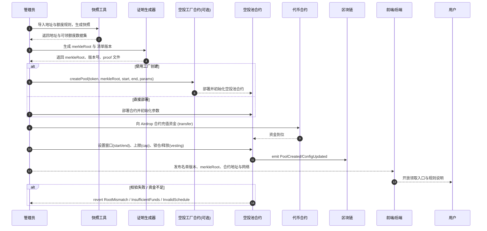

- 注：
  - 名单需版本化与审计留痕；前端展示版本号与发布时间避免错配。
  - 建议使用工厂合约统一创建与事件索引，便于可观测性与管理。
  - 资金到位与窗口设置需链上事务确认后再开放领取入口。

2 领取空投操作

以下示意图展示从前端到合约的领取（Claim）端到端交互流程：

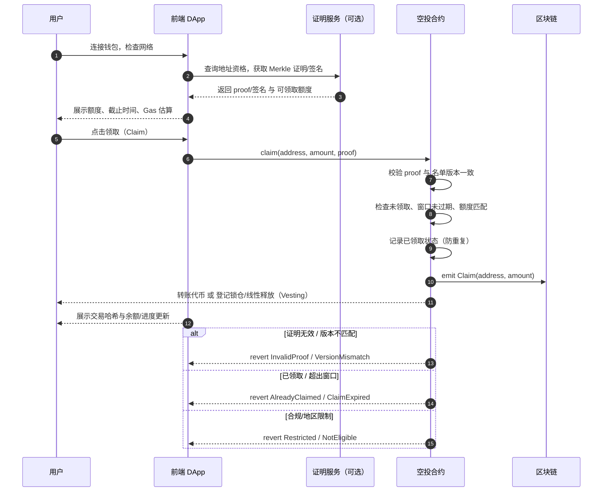

- 注：

  - 若启用代理/批量领取，需在 UI 显示代理授权与可能的服务费。
  - 失败重试需提示潜在重复交易与 Gas 风险，并建议检查名单版本号与合约地址。
  - 启用锁仓/线性释放时，展示剩余可提额度、下一次可提时间与释放速率。

- Proof 来源与推广操作说明（Referral/Quest）：
  - 推广行为范畴：邀请注册/完成任务、社媒互动（关注/转发/发帖）、内容贡献、交易达成等与项目增长相关的动作。
  - 采集与归因：通过推荐码/专属链接（UTM 参数）、前端签名打点、链上事件订阅记录用户完成度；采用 `last-click` 或多触点模型并去重防作弊。
  - 后端生成：定期聚合达成数据，计算可领取额度，生成名单与 `merkleRoot`，发布版本；前端按地址加载对应 `proof`。
  - 隐私与合规：避免收集敏感信息，尽量采用哈希化标识或 zk 证明；在 UI 清晰注明数据使用范围与条款。
  - 反女巫与申诉：对异常地址触发灰/黑名单策略，并提供申诉通道与复核时效；版本化记录每次调整与原因。

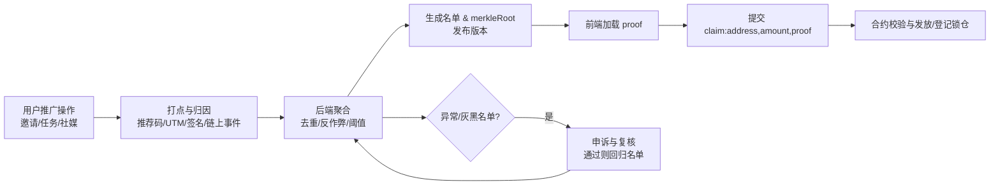

3 防女巫操作

— 概念：女巫攻击指同一实体用多个地址“薅空投”，导致资源不公平分配。防女巫旨在用可解释或可审计的规则/模型识别并限制此类地址，平衡公平、覆盖与隐私/合规。

- 策略与信号示例：

  - 地址行为特征：创建时间、首次入金来源、资金流动性、交互多样性（合约/协议种类）、主动/被动交易比例、桥接与跨链频次、代币持仓稳定性等。
  - 图谱与聚类：资金流向关系、共同控制迹象（共享出入金、批量操作、同步行为）。
  - 设备/浏览器指纹（可选）：需遵循隐私与合规要求，仅用于提示，不作为唯一拒绝依据。
  - 身份/合规（可选）：KYC、PoH 或 zk 证明（在不泄露隐私的前提下证明唯一性/地区合规）。
  - 规则落地：白名单（正常领取）、灰名单（额度折扣或延迟）、黑名单（拒领并给出原因与申诉通道）。

- 页面操作步骤：
  - 用户侧：连接钱包 → 资格查询 → 风控评估（白/灰/黑状态与原因）→ 如灰名单，展示折扣与申诉入口 → 提交 `claim` 或完成申诉后再次尝试。
  - 管理侧：数据快照 → 特征抽取与模型评分 → 名单生成与版本化（白/灰/黑）→ 发布版本与规则摘要 → 监控误判与申诉结果，迭代阈值与特征。

以下示意图展示申领时的防女巫评估与分支处理：

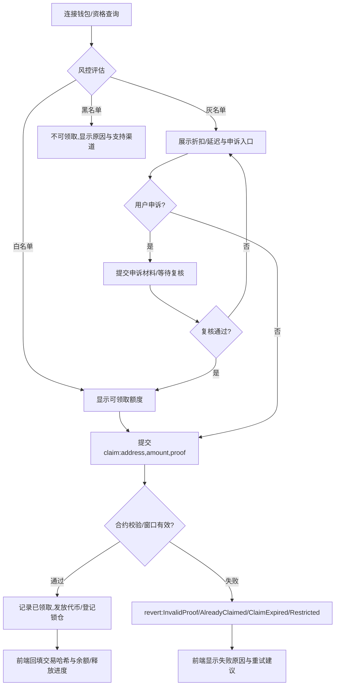

- 关键参数与提示： 
  - 名单版本与 proof 一致性；在 UI 显示版本号、发布时间与合约地址，防钓鱼与错链。
  - 风控阈值与解释：为灰/黑名单提供简明理由与申诉流程，降低误杀率；记录处理时效与结果。
  - 成本与体验：灰名单折扣与延迟需明确展示；申诉通道避免过度收集隐私数据，建议采用 zk 证明或链上行为补证。

### 3.6 ai代理


## 四、技术架构设计

### 技术栈

### 合约架构

### 前端架构

### 后端服务

### 接口定义

#### 1 交易(Swap)

按接口区分：操作类接口和查询类接口
为保证前端/后端与链上/第三方服务的协同一致，Swap 接口划分为“操作类（交易/签名）”与“查询类（只读/行情/路由）”。下面给出典型接口清单与作用说明，便于实现与联调。

 1 操作类接口（交易/签名）
- 钱包与签名：
  - `eth_requestAccounts` / `wallet_switchEthereumChain`：连接钱包与网络切换。
  - `personal_sign` / `eth_signTypedData_v4`：用于离线授权或链下签名（如某些聚合器需要）。
- 授权与额度：
  - `ERC20.approve(spender, amount)`：标准授权，供路由合约消费代币。
  - `Permit2.permit(address owner, address token, amount, deadline, signature)`：无须先发 approve 的授权方式，提升 UX。
- 代币包装与解包：
  - `WETH.deposit()` 与 `WETH.withdraw(amount)`：原生 ETH 与 WETH 转换。
- 路由与交换（示例按常见 DEX）：
  - Uniswap v2：`Router.swapExactTokensForTokens`, `swapTokensForExactTokens`, `swapExactETHForTokens`, `swapExactTokensForETH`。
  - Uniswap v3：`Router.exactInputSingle`, `exactInput`, `exactOutput`, `multicall`, `unwrapWETH9`。
  - 聚合器：`1inch Router` / `0x Exchange Proxy` 的 `swap`/`transformERC20` 等交易端点（通过 API 返回 calldata + `to` 地址，前端直接 `eth_sendTransaction`）。
- 跨链（如启用）：
  - 桥合约：`Bridge.lock/mint/burn/redeem` 等；或跨链聚合器（Socket/LI.FI）提供的 `callData` 执行交易。
- 交易提交：
  - `eth_estimateGas`, `eth_sendTransaction`：前端估算 Gas 与提交；后端可选提供代付或预执行检查。

 2 查询类接口（只读/行情/路由/监控）
- 链上只读：
  - Uniswap v2：`Pair.getReserves`, `Factory.getPair`；读取储备与池子地址。
  - Uniswap v3：`Pool.slot0`, `liquidity`, `ticks`；读取价格刻度与流动性。
  - 价格/路由预估：`QuoterV2.quoteExactInputSingle`, `quoteExactInput`, `quoteExactOutput`。
  - 账户状态：`ERC20.balanceOf`, `ERC20.allowance`；前端校验余额与授权。
- 路由与报价 API：
  - `1inch / 0x / OpenOcean` Quote：输入 `sellToken/buyToken/amount/address` 返回最优路径、价格影响与 calldata（仅查询不执行）。
  - `Paraswap`：价格与路径对比，用于聚合策略参考。
- 行情与图表：
  - `TradingView` Widget / `Lightweight Charts`：前端图表组件；数据源可接 `CoinGecko/CoinMarketCap` 或自建后端。
  - K 线与统计：`The Graph`（Uniswap/Sushi 官方或社区子图）拉取 TVL、交易量、历史价格聚合。
- 风险与监控：
  - 事件订阅：路由/池子事件（暂停、迁移、费率调整）；用于 UI 告警。
  - MEV 与失败分布：后端统计失败类型与价格偏差，前端展示提示。
- 可观测性：
  - 健康检查与限流信息：后端或第三方 API 的状态页，前端在数据视图显示来源与延迟。

 字段与约定（建议）
- 操作请求（示例）：
  - `SwapRequest`：`sellToken`, `buyToken`, `amountIn`, `slippage`, `deadline`, `route`, `permitSig?`, `chainId`。
  - 返回：`to`, `data`, `value`, `gas`, `quote`, `priceImpact`, `sources`。
- 查询响应（示例）：
  - `MarketQuote`：`price`, `ts`, `source`, `route`, `liquidityShare`, `estimatedGas`, `successRate`。
  - `PoolState`：`reserve0/1` 或 `slot0/liquidity/tick`, `fee`, `paused?`。

 集成与容错
- 主源/备源：为报价与路由配置主源与备源，失败时回退并在 UI 标注“来源切换/数据延迟”。
- 一致性：所有接口返回需包含 `ts` 与 `source` 字段，便于用户理解数据新鲜度。
- 合规与版权：明确第三方 API/图表组件使用条款与品牌规范，遵守速率限制。

#### 2 流动性（liquidity）

#### 3 借贷(Lend)

#### 4 质押（Stake）

#### 5 空投（AirDrop）

#### 6 ai代理


## 五、数据库设计
