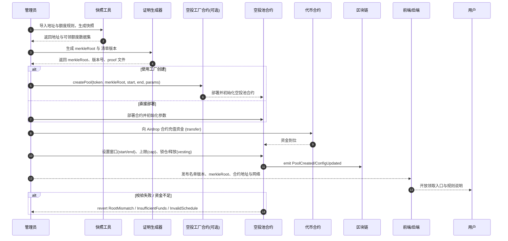
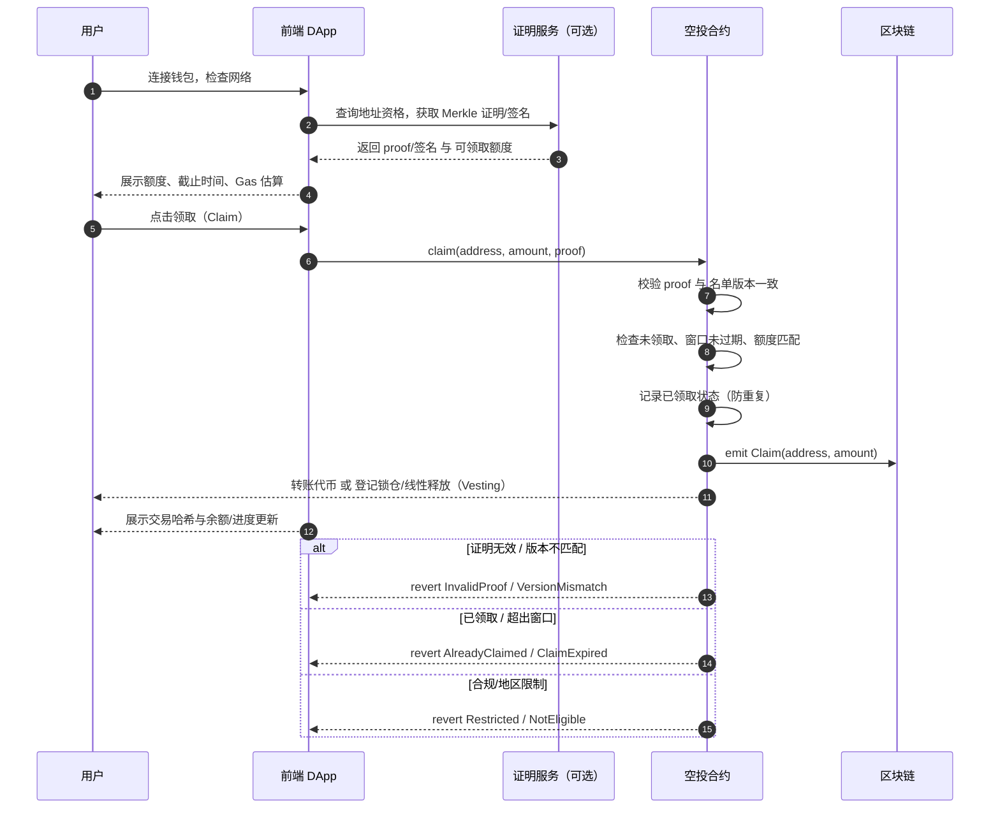
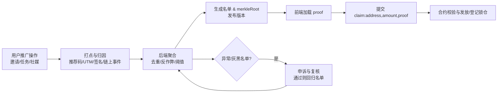
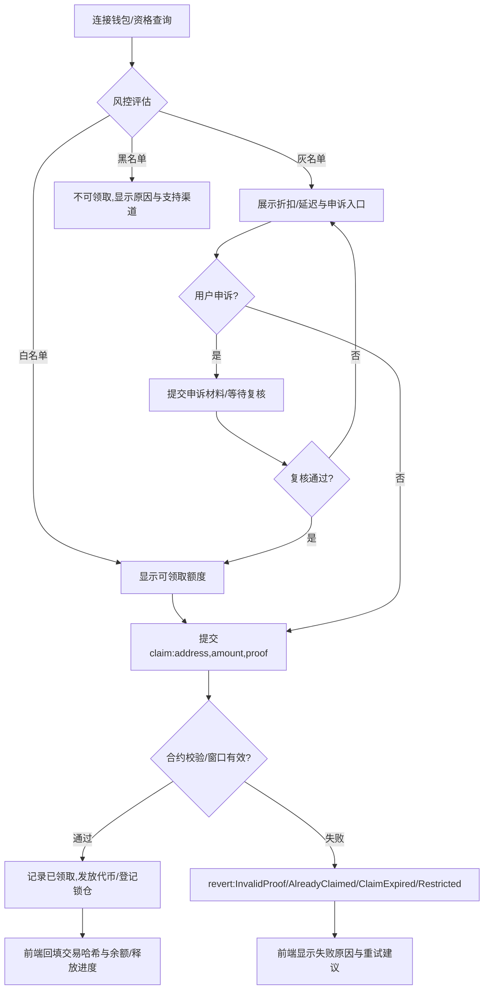

ZippiFi 项目模仿 uniswap，aave，compound 等项目，包括，swap（交易），liquidity（流动性），lend(借贷),stake(质押)，airdrop（空投） ，ai 建议等几大功能。

目前要求对 airdrop（空投） 进行详细分析，整理到下面：

---

## 任务范围

- 仅分析 `Airdrop`（空投）功能的产品与技术设计。
- 范围涵盖：资格规则与快照、反女巫/防刷、分发与领取流程、合约与数据存储、前后端交互与可观测性。
- 合约与分发：`MerkleDistributor`/白名单签名、`ERC20` 发放、`claim` 校验、重复领取防护、可选 `vesting/锁仓/线性释放`、领取截止与回收策略。
- 数据与后端：快照生成、Merkle 树/证明计算、名单版本化与存储（`IPFS/Arweave/S3`）、接口鉴权与限流、反刷评分。
- 前端与交互：钱包与网络检查、资格查询与证明加载、`claim` 提交与结果反馈、Gas 估算与失败重试、状态与历史。
- 风控与合规：地址黑名单/地区限制（可选）、条款确认、异常监控与欺诈检测。
- 可观测性：领取人数/金额、失败原因分布、时间窗口表现、合约事件索引与仪表板。
- 范围不含：`Swap/流动性/Lend/Stake/AI建议` 等其他模块与完整代币经济学，仅与空投相关的参数与流程。

## airdrop（空投）功能简介：

### 概念

空投用于按既定资格规则向地址分发代币或积分，通常通过 Merkle 证明或离线签名校验来保证领取合法性；用户在前端完成资格查询与证明加载后发起领取交易，合约侧防重复与记录；可选支持锁仓/线性释放（Vesting），并配合反女巫与合规限制以保障公平与安全。

### 小功能（模块）：

- 资格规则与快照：定义纳入/排除标准，生成区块高度或时间点的地址余额/行为快照。
- 名单生成与版本化：形成包含地址与可领取额度的名单，支持版本号与变更审计。
- 证明生成与校验：基于 `merkleRoot + proof` 或离线签名的方式，链上校验领取合法性。
- 分发合约与防重复：记录已领取状态，防止重复调用，支持事件索引与查询。
- 领取与结果回填：前端提交 `claim`，展示交易哈希、状态与领取后余额变化。
- 锁仓/线性释放（Vesting）：支持 TGE 比例、崖期、线性释放速率与提取上限。
- 代理/批量领取（可选）：允许经授权的代理账户代用户领取或批量处理多个地址。
- 黑名单与地区限制（可选）：合规策略与限制提示，前端显式标注不可领取原因。
- 错误重试与归因：对常见失败进行识别与重试策略（网络、证明、已领取等）。
- 可观测性与报表：领取人数/金额、失败原因分布、窗口表现与事件仪表板。

### 页面操作步骤：

- 用户侧：连接钱包 → 资格查询 → 加载证明/签名 → 检查网络与 Gas → 提交 `claim` → 交易确认 → 结果反馈与历史记录。
- 管理侧：导入快照 → 生成 Merkle/签名清单 → 配置分发合约参数（`merkleRoot`/截止时间/释放计划等）→ 发布名单版本 → 开放领取窗口 → 监控事件与异常 → 过期回收与报表输出。

### 页面展示与信息架构：

- 主页面控件：钱包连接、资格状态（可领取/不可领取与原因）、可领取额度、证明/签名加载、`claim` 按钮、截止时间、锁仓进度（如适用）、历史领取记录与交易链接。
- 规则与说明：资格规则摘要、名单版本号与发布时间、合约地址与网络、合规/地区限制提示、反女巫策略说明。
- 进阶选项：批量/代理领取入口（如启用）、网络切换、Gas 估算与失败重试、问题反馈与支持。

### 关键参数与提示：

- `merkleRoot / proof` 或离线签名来源与校验；确保与前端载入的名单版本一致。
- 链与合约地址：明确网络与合约，防钓鱼域名与假合约；交易前显示 `chainId` 与 `contract`。
- 领取截止与回收规则：展示截止时间、逾期未领的回收/后续处理方式。
- 锁仓/释放参数：TGE 比例、崖期、线性释放速率、提取频率与上限；前端显示剩余可提取额与下一次可提时间。
- 成本与费用：交易 Gas 估算、可能的服务费（如代理领取）、失败重试的 Gas 风险提示。
- 防重复与常见错误：已领取/重复提交、证明无效/与版本不匹配、地址不在名单、网络错误/Nonce 冲突、窗口已结束等。
- 安全与合规：警示仿冒站与钓鱼链接、展示域名校验与签名信息；如启用地区限制或 KYC，需清晰提示并提供支持渠道。

## 主要功能说明

### 创建空投池操作

- 概念：空投池是用于集中管理本次分发参数与资金的合约实例或配置项，包含代币来源、名单版本（`merkleRoot`/签名规则）、领取窗口、上限与锁仓/线性释放等关键要素，并在链上记录事件与已领取状态以防重复与便于审计。
- 作用：
  - 标准化分发：统一入口与规则，减少人工操作与错误率。
  - 风控与合规：支持黑/灰名单、地区限制、截止与回收策略，提升公平与安全。
  - 可观测性：通过事件与仪表板统计 TVL/领取人数/失败原因，便于监控与优化。
  - 运维与治理：支持暂停/恢复、参数更新（如延长窗口/替换 `merkleRoot`）、锁仓配置调整，形成版本化与审计轨迹。
  - 用户体验：明确网络与合约地址、规则摘要与时间提示，降低失败与误导风险。

以下示意图展示管理侧创建与配置空投池的端到端流程：

- 注：
  - 名单需版本化与审计留痕；前端展示版本号与发布时间避免错配。
  - 建议使用工厂合约统一创建与事件索引，便于可观测性与管理。
  - 资金到位与窗口设置需链上事务确认后再开放领取入口。

### 领取空投操作

以下示意图展示从前端到合约的领取（Claim）端到端交互流程：

- 注：

  - 若启用代理/批量领取，需在 UI 显示代理授权与可能的服务费。
  - 失败重试需提示潜在重复交易与 Gas 风险，并建议检查名单版本号与合约地址。
  - 启用锁仓/线性释放时，展示剩余可提额度、下一次可提时间与释放速率。

- Proof 来源与推广操作说明（Referral/Quest）：
  - 推广行为范畴：邀请注册/完成任务、社媒互动（关注/转发/发帖）、内容贡献、交易达成等与项目增长相关的动作。
  - 采集与归因：通过推荐码/专属链接（UTM 参数）、前端签名打点、链上事件订阅记录用户完成度；采用 `last-click` 或多触点模型并去重防作弊。
  - 后端生成：定期聚合达成数据，计算可领取额度，生成名单与 `merkleRoot`，发布版本；前端按地址加载对应 `proof`。
  - 隐私与合规：避免收集敏感信息，尽量采用哈希化标识或 zk 证明；在 UI 清晰注明数据使用范围与条款。
  - 反女巫与申诉：对异常地址触发灰/黑名单策略，并提供申诉通道与复核时效；版本化记录每次调整与原因。

### 防女巫操作

— 概念：女巫攻击指同一实体用多个地址“薅空投”，导致资源不公平分配。防女巫旨在用可解释或可审计的规则/模型识别并限制此类地址，平衡公平、覆盖与隐私/合规。

- 策略与信号示例：

  - 地址行为特征：创建时间、首次入金来源、资金流动性、交互多样性（合约/协议种类）、主动/被动交易比例、桥接与跨链频次、代币持仓稳定性等。
  - 图谱与聚类：资金流向关系、共同控制迹象（共享出入金、批量操作、同步行为）。
  - 设备/浏览器指纹（可选）：需遵循隐私与合规要求，仅用于提示，不作为唯一拒绝依据。
  - 身份/合规（可选）：KYC、PoH 或 zk 证明（在不泄露隐私的前提下证明唯一性/地区合规）。
  - 规则落地：白名单（正常领取）、灰名单（额度折扣或延迟）、黑名单（拒领并给出原因与申诉通道）。

- 页面操作步骤：
  - 用户侧：连接钱包 → 资格查询 → 风控评估（白/灰/黑状态与原因）→ 如灰名单，展示折扣与申诉入口 → 提交 `claim` 或完成申诉后再次尝试。
  - 管理侧：数据快照 → 特征抽取与模型评分 → 名单生成与版本化（白/灰/黑）→ 发布版本与规则摘要 → 监控误判与申诉结果，迭代阈值与特征。

以下示意图展示申领时的防女巫评估与分支处理：

- 关键参数与提示：
  - 名单版本与 proof 一致性；在 UI 显示版本号、发布时间与合约地址，防钓鱼与错链。
  - 风控阈值与解释：为灰/黑名单提供简明理由与申诉流程，降低误杀率；记录处理时效与结果。
  - 成本与体验：灰名单折扣与延迟需明确展示；申诉通道避免过度收集隐私数据，建议采用 zk 证明或链上行为补证。
